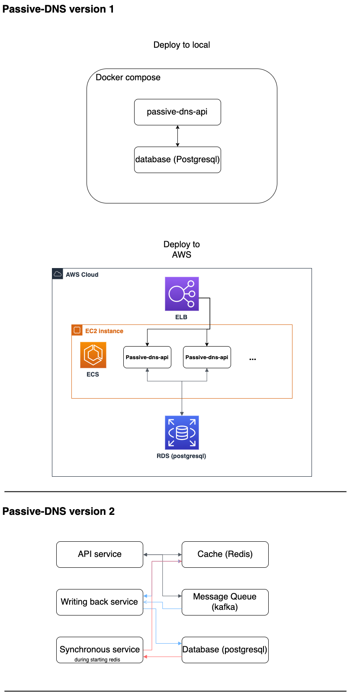

# Passive-DNS
An api service of passive dns

## How to deploy
### Requirement
* docker (17.05 or higher) // I use multi-stage builds in DockerFile
* docker-compose
* git

### Deployment
* clone this project
* go to project
* build passive-dns-api image
```
sudo docker build -t passive-dns-api -f deployment/API_DockerFile .
```
* build passive-dns-db image
```
sudo docker build -t passive-dns-db -f deployment/DB_DockerFile .
```
* execute service with docker-compose
```
sudo docker-compose -f deployment/docker-compose.yml up
```

## API Document
* [API document](https://app.swaggerhub.com/apis-docs/vaporting/passive-dns/1.0)

### /passive_domains_ips/search
Search targets(ip, domain) and return passive DNS
* **request**
    * method: POST
    * Body:
    ```
    {
        "domains": [<domain1>, <domain2>, ...],
        "ips": [<ip1>, <ip2>, ...]
    }
    
    ```
    ```
    e.g.
    {
        "domains": ["www.google.com"],
        "ips": ["217.10.5.20"],
    } 
    ```

* **response**
    * Body:
    ```
    {
        <domain1>: {
             cnames: {
                <passive_domain1>: {
                    first_seen: <date>,
                    last_seen: <date>
                 },
                 ...
             },
             ips: {
                <passive_ip1>: {
                    first_seen: <date>,
                    last_seen: <date>
                 },
                 ...
             }
         },
         ...

        <ip1>: [
            {<passive_domain1>: {
                    first_seen: <date>,
                    last_seen: <date>
                }
            },
            ...
        ],
        ...
    }
    ```
    ```
    e.g.
    {
        "domians": {
            "www.google.com": {
                "cnames": {
                    "tw.google.com": {
                        "first_seen": 2019-02-01,
                        "last_seen": 2019-02-15
                    },
                    "us.google.com": {
                        "first_seen": 2019-01-15,
                        "last_seen": 2019-02-10
                    }
                },
                "ips": {
                    "10.20.1.99": {
                        "first_seen": 2019-01-17,
                        "last_seen": 2019-02-09
                    }
                }
            }
        },
        "ips": {
            "217.10.5.20": [
                {
                "us.google.com": {
                    "first_seen": 2019-01-17,
                    "last_seen": 2019-03-09
                }
                },
                ...
            ]
        }
    }
    ```
### /passive_domains_ips
Insert resolutions to server
* **request**
    * method: PUT
    * Body:
    ```
    {
        source: <source>, # Need to predefine in database
        resolved_entries: [
            {
                name: <domain>,
                type: <A|CNAME|AAAA>,
                value: <ip|domain>,
                first_seen: <date>,
                last_seen: <date>
            },
            ...
        ]
    }

    example:
    {
        source: "common",
        resolved_entries: [
            {
                "name":"google.com",
                "type": "A",
                "value": "8.8.8.8",
                "first_seen": 2019-05-24,
                "last_seen": 2019-05-30
            },
            {
                "name":"www.google.com",
                "type": "CNAME",
                "value": "tw.google.com",
                "first_seen": 2019-05-24,
                "last_seen": 2019-05-30
            },
            ...
        ]
    }
    ```
* **response**
    * status code: 200
    
## System Architecture

